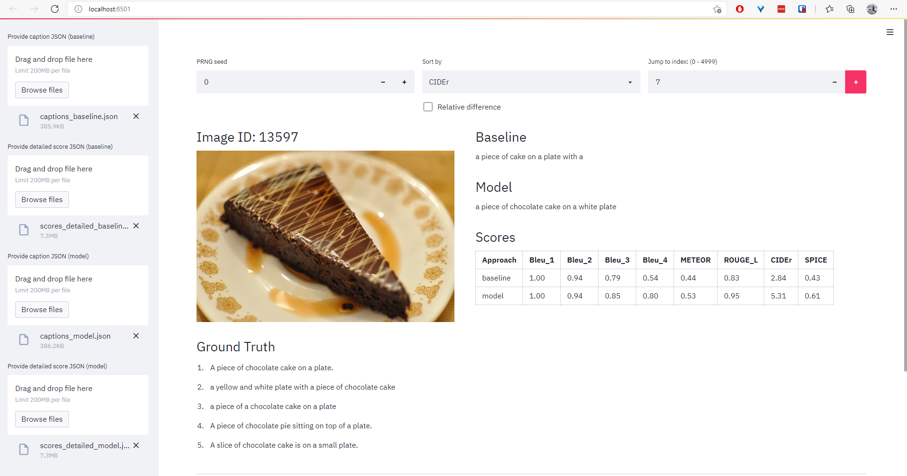

# MS-COCO Caption Explorer

A Streamlit UI tool for exploring MS-COCO captions.

Just clone this repo and start exploring.

## Explore generated captions

Run `streamlit run explore_gen_captions.py`

## Requirements

Requires Python 3.9+, as new features such as dictionary union operator are used.
